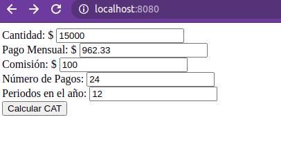

# CATCalculation
Show how CAT is calculated


Use *org.apache.poi*

```xml
		<!-- https://mvnrepository.com/artifact/org.apache.poi/poi -->
		<dependency>
			<groupId>org.apache.poi</groupId>
			<artifactId>poi</artifactId>
			<version>5.0.0</version>
		</dependency>

```

Use the maven spring boot maven run command.

```sh
		mvn spring-boot:run

```

Sample:




Test in HEROKU: https://cat-calculation.herokuapp.com/


